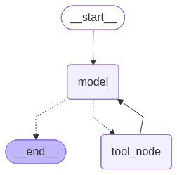

# Perplexity 2.0

A modern, responsive AI chat interface with integrated web search functionality. Perplexity 2.0 provides a clean UI similar to Perplexity.ai, combining conversational AI with real-time search capabilities.

## ✨ Features

* **Real-time AI Responses** – Stream AI responses as they're generated
* **Integrated Web Search** – AI can search the web for up-to-date information
* **Conversation Memory** – Maintains context throughout your conversation
* **Search Process Transparency** – Visual indicators show searching, reading, and writing stages
* **Responsive Design** – Clean, modern UI that works across devices

---

## 🏗️ Architecture

Perplexity 2.0 follows a client-server architecture:

### Client (Next.js + React)

* Modern React application built with Next.js
* Real-time streaming updates using Server-Sent Events (SSE)
* Components for message display, search status, and input handling

### Server (FastAPI + LangGraph)

* Python backend using FastAPI for API endpoints
* LangGraph implementation for conversation flow with LLM and tools
* Integration with **Tavily Search API** for web searching capabilities
* **Groq LLM (LLaMA 3)** for fast and cost-free AI inference
* Server-Sent Events for real-time streaming of AI responses

---

## 🚀 Getting Started

### Prerequisites

* Node.js 18+
* Python 3.10+
* **Groq API key**
* Tavily API key

---

### Installation

#### 1. Clone the repository

```bash
git clone https://github.com/aliaa039/perplexity.git
cd perplexity
```

---

#### 2. Set up the server

```bash
cd server
python -m venv .venv
source .venv/Scripts/activate   # Windows (Git Bash)
pip install -r requirements.txt
```

---

#### 3. Configure environment variables

Create a `.env` file inside the `server` directory:

```env
GROQ_API_KEY=your_groq_api_key_here
TAVILY_API_KEY=your_tavily_api_key_here
```

#### 4. Set up the client

```bash
cd ../client
npm install
```

---

## ▶️ Running the Application

### 1. Start the server

```bash
cd server
uvicorn app:app --reload
```

### 2. Start the client

```bash
cd client
npm run dev
```

### 3. Open your browser

```
http://localhost:3000
```

---

## 🔍 How It Works

1. **User sends a message** through the chat interface
2. **Server processes the message** using **Groq LLaMA-3**
3. **AI decides** whether to use web search or respond directly
4. If search is needed:

   * Query is sent to **Tavily Search API**
   * Results are processed and injected into the prompt
   * AI formulates a grounded response
5. **Response is streamed** back to the client in real-time
6. **Search stages are displayed** to the user (searching, reading, writing)

---

## 🤝 Contributing

Contributions are welcome!

1. Fork the repository
2. Create your feature branch (`git checkout -b feature/amazing-feature`)
3. Commit your changes (`git commit -m 'Add some amazing feature'`)
4. Push to the branch (`git push origin feature/amazing-feature`)
5. Open a Pull Request

---

## 📝 License

This project is licensed under the MIT License.

---

## 🙏 Acknowledgments

* Inspired by the UI and functionality of [Perplexity.ai](https://www.perplexity.ai/)
* Built with [Next.js](https://nextjs.org/), [React](https://reactjs.org/), [FastAPI](https://fastapi.tiangolo.com/), and [LangGraph](https://github.com/langchain-ai/langgraph)
* Powered by **Groq (LLaMA 3)** and **Tavily Search API**
